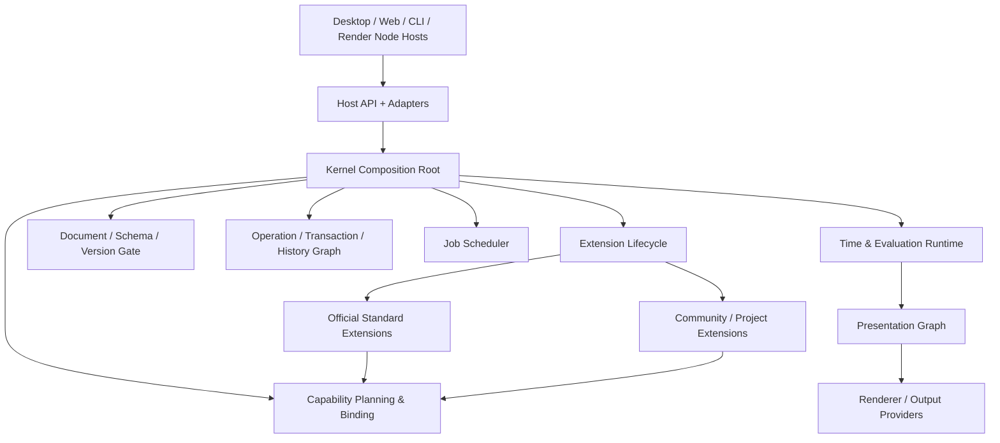
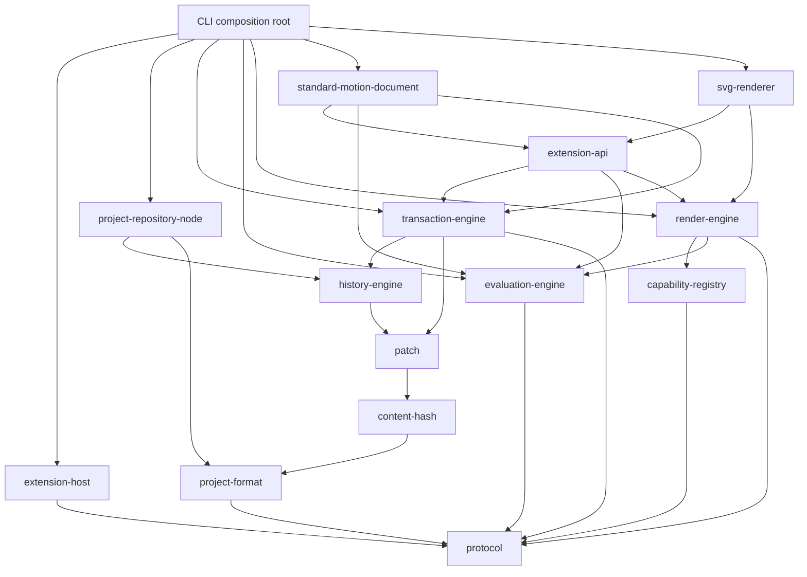

# KineWeave 当前基础架构施工蓝图

- 状态：Working Architecture
- 日期：2026-07-22
- 适用范围：Kernel、开放工程、扩展、事务历史、时间求值、渲染边界及首批官方扩展

## 1. 施工原则

KineWeave 不采用抛弃式 MVP，也不假设一次设计可以得到永久架构。当前施工方式是：

1. 先识别修改成本高、会影响持久化数据和模块边界的当前约束。
2. 按依赖顺序实现完整子系统，每个子系统都包含诊断、测试、失败恢复和扩展接缝。
3. 尚未稳定的代码和持久化数据直接重构或重建，不保留只为旧草稿服务的兼容层、Reader 或迁移器。
4. 工程文件、锁文件、事务日志和跨进程消息保留版本字段以避免歧义；开发期只支持当前版本，不维护草稿迁移链。
5. Studio、CLI、渲染节点和自动化脚本共享同一套领域服务；任何宿主都不得维护隐藏的第二套工程语义。

“分阶段”只描述施工顺序，不把临时实现包装成产品完成度，也不阻止实现反馈推动架构修正。

## 1.1 决策不是永久结论

本蓝图记录当前最合理、足以继续施工的设计假设。每项决策按变更成本处理：

| 决策类型 | 典型内容 | 当前策略 |
|---|---|---|
| 低成本、可逆 | 内部类、函数、目录、缓存实现 | 直接重构，不兼容旧草稿 |
| 中成本 | 包边界、Experimental SDK、运行时服务接口 | 通过调用场景和测试调整，变更时更新调用方 |
| 高成本、仍可演进 | 工程格式、Stable ID 语义、跨进程消息、事务日志 | 开发期直接更新；公开基线后才启用迁移、诊断和回滚责任 |
| 外部稳定承诺 | 已发布 Stable API 与真实用户工程 | 语义化版本、兼容测试和明确弃用期 |

出现以下情况时必须重新评审相关决定，而不是机械维护原设计：

- 第二种宿主或实现无法自然接入；
- 性能基准表明抽象造成不可接受的成本；
- 未知扩展数据无法无损往返；
- 事务、协作或渲染场景暴露语义冲突；
- 实际创作工作流与模型假设明显不符；
- 为维护接口而开始增加只服务旧草稿的兼容分支。

## 2. 系统分层



### 2.1 Protocol

Protocol 只包含可以跨文件、进程和语言传递的值对象与消息：

- 稳定 ID 和资源 URI；
- JSON 值、诊断和版本化 Envelope；
- 工程 Manifest、Lockfile 和 Document Header；
- 扩展 Manifest 与 Capability 描述；
- Operation、Transaction Proposal、Commit Record 和 Patch；
- Rational、Time Value、Evaluation Request；
- Presentation Graph 与 Renderer Feature 描述。

Protocol 不包含服务实例、文件系统、事件总线、UI 对象或框架组件。

### 2.2 Kernel mechanisms

Kernel 负责机制，不理解标准 Motion 语义：

- 扩展发现、解析、加载、激活、停用和故障隔离；
- Capability 计划、绑定、生命周期作用域与替换选择；
- 文档打开、当前版本检查和原子保存；公开格式基线之后再承担已发布版本的迁移编排；
- Operation 注册、事务准备、校验、提交和历史分支；
- Job 调度、取消、进度和资源限制；
- Host 服务注入与跨进程桥接；
- 统一诊断、日志和恢复入口。

Kernel 不内置 Composition、Node、Track、字幕、Remotion、FFmpeg 或任何 AI Provider。

### 2.3 Extensions own meaning

官方 `standard-motion-document` 与社区扩展通过相同接口注册：

- 文档 Schema；公开基线后由拥有该 Schema 的扩展提供真实发布版本之间的迁移；
- Operation Handler 与语义合并；
- Node / Property / Time Domain；
- Evaluator 与 Presentation Adapter；
- Renderer、Output Target、Workbench 和 AI Tool。

官方发行版的默认选择由 Distribution Profile 表达，不写死在 Kernel 中。

## 3. 包依赖方向

下图记录当前已经形成的依赖层次，不是未来包名清单；箭头由组合方指向其依赖：



约束：

- `protocol` 无运行时依赖且不依赖 Node。
- 持久化格式和运行时服务接口分包，避免文件布局反向控制内存模型。
- `kernel` 是组合根，不成为所有代码相互引用的“万能包”。
- 官方扩展只能依赖公开 SDK/服务接口，不能导入 Kernel 私有实现。
- 宿主适配器位于依赖图边缘；核心服务不直接调用 Node、Electron 或浏览器全局对象。

包只在其边界已经有独立职责和测试压力时创建，不建立空目录占位。

## 4. 正式状态与派生状态

### 4.1 Canonical Project State

进入版本控制、决定作品语义的内容：

- `kineweave.project.json`；
- `kineweave.lock.json`；
- `documents/`；
- 组件、Shader、脚本和项目扩展；
- 素材原件或稳定外部引用；
- 输出配置、品牌 Token、字幕和数据。

### 4.2 Local Derived State

可删除、可重建、默认不提交：

- 索引、缩略图、代理、波形和帧缓存；
- 编辑器布局、选择、播放头；
- 本地 API Key、工具路径和模型地址；
- 构建产物与性能采样。

### 4.3 History State

历史不是聊天记录，也不是只存在内存的 Undo 栈。当前持久化形态由根文档快照、Commit DAG 和 Branch Ref 构成：

- 每个 Commit 引用一个或多个父 Commit；
- 每个事务记录操作意图、作用域、来源、前置条件、验证结果和通用正/逆 Patch；
- Proposal Branch 使用相同 Commit 语义，但未合并前不移动主分支；
- Git 历史与内部创作历史相互独立。

当前数据写入 `.kineweave/history/history.json`，与物化文档在同一个 Repository 文件事务中提交。领域 Operation 用于表达意义，通用 Patch 用于可靠恢复与回退，不要求保留旧命令处理代码。历史规模使单文件恢复成本不可接受时，再根据实测引入 Checkpoint 与 Patch Pack；开发期直接替换当前格式，不保留草稿兼容读取器。

## 5. 身份、引用与内容寻址

### 5.1 Stable ID

- 长期对象使用不带位置含义的稳定 ID。
- 用户可读名称是可修改 Alias，不能充当引用键。
- ID 删除后默认不复用。
- 数组索引、文件名、源码行号和显示顺序都不是身份。

### 5.2 Resource URI

工程内引用采用规范 URI：

```text
kw://project/document/{documentId}
kw://project/document/{documentId}/node/{nodeId}
kw://project/asset/{assetId}
kw://project/component/{componentId}
kw://extension/{extensionId}/schema/{schemaId}/{version}
```

`kw://project` 表示当前工程，因此工程移动和复制不会改写内部引用。外部工程引用必须显式使用可解析的外部 Locator，不能把本机绝对路径写入 Canonical State。

### 5.3 Content hash

Document Revision、素材、Checkpoint 和渲染输入使用明确算法的内容哈希。哈希用于一致性和缓存，不代替 Stable ID。

## 6. 开放工程格式

### 6.1 三层版本

版本彼此独立：

1. Project Container Version：目录、Manifest 和 Lockfile 结构。
2. Document Schema Version：由文档类型 Provider 维护。
3. Extension-owned Data Version：节点或自定义数据内部版本。

升级某个插件节点不应迫使整个工程容器升级。

### 6.2 Document Envelope

每个文档包含基础设施可读的 Header 和扩展拥有的 Data：

```json
{
  "documentId": "document_main",
  "documentType": "org.kineweave.standard-motion/composition",
  "schemaVersion": 1,
  "data": {}
}
```

基础设施只校验 Header 和已注册 Schema。未安装扩展时，`data` 作为不透明 JSON 无损保留。

### 6.3 Development reset and future migration

- 在第一次公开格式基线前，仓库只支持当前 Schema；旧样例、Fixture 和开发工程直接重建。
- 开发期不注册旧版本 Reader，不生成草稿迁移链，也不保留兼容分支。
- Schema 版本字段仍保留，用于检测误读和形成未来正式版本边界。
- 第一次公开格式基线发布后，再引入 `(type, fromVersion, toVersion)` Migration、备份、变更摘要和回滚流程。
- 未知字段无损保留属于当前读写正确性要求，不等同于兼容旧 Schema。

### 6.4 Canonical serialization

- UTF-8、LF、文件末尾换行；
- 对象键按稳定规则排序，数组保持领域顺序；
- 禁止 `NaN`、`Infinity`、`undefined`；
- 有理数的大整数以十进制字符串保存；
- 临时 UI 状态不进入正式文档。

## 7. 扩展生命周期与 Capability

### 7.1 生命周期

```text
discovered -> resolved -> loaded -> activated -> deactivated -> unloaded
                               \-> failed
```

- Discover 只读取 Manifest，不执行代码。
- Resolve 按宿主类型与 Runtime 选择 Entry Point，并对整组版本/依赖约束做确定性回溯求解，不采用会错过可行解的逐项贪心选择。
- Load 建立隔离宿主或 RPC Endpoint。
- Activate 才能注册服务和订阅资源。
- Deactivate 必须释放注册、任务和句柄。
- Failed 扩展保留诊断，并允许 Safe Mode 重新打开工程。

同一 Extension Host 的激活与停用串行执行，避免异步重入造成重复注册。官方扩展的多项贡献注册视为一个激活单元：中途失败立即按逆序撤销已注册贡献；批量停用时单个扩展清理失败不能阻止其余扩展继续回收，失败项保留诊断并允许重试。

### 7.2 Capability selection

Capability Requirement 描述契约版本和必需 Feature；Provider 描述实现版本、环境约束、依赖、生命周期和 Feature Set。

选择优先级：

1. Lockfile 中已确认的精确绑定；
2. 工程显式选择；
3. Distribution Profile 默认选择；
4. Provider 优先级；
5. Provider ID 的确定性排序。

解析先对全部顶层 Requirement 与 Provider 依赖做全局回溯，得到完整计划后再统一激活。不能在查找某项服务时临时、隐式地改变整个 Provider 图，也不能因为先处理的需求锁定了局部最优 Provider 而误报本来存在解的冲突。

Provider 生命周期至少区分：

- `singleton`：宿主生命周期；
- `project`：工程会话生命周期；
- `job`：单次分析或渲染任务；
- `transient`：每次请求。

同一 Capability 可以多实现共存；是否独占由契约声明，而不是 Registry 全局假设。

## 8. Operation、事务与历史

### 8.1 Operation

Operation 是版本化、可序列化的领域意图：

```text
operationId
operationType
schemaVersion
targets
payload
preconditions
```

用户、AI、脚本和插件最终都生成同一种 Operation。来源、Actor、Intent、锁定范围和模型信息属于 Transaction Metadata。

### 8.2 Transaction preparation

事务分为：

1. Parse：结构校验。
2. Resolve：找到 Operation Handler 和目标资源。
3. Prepare：在隔离 Draft 中执行，收集读写集和诊断。
4. Validate：执行文档 Schema、跨文档不变量和宿主策略校验。
5. Commit：对基础 Revision 做 CAS，并原子写入全部文档和 Commit Record。
6. Publish：提交成功后才发送事件、刷新 UI 和启动派生任务。

任何阶段失败都不改变正式状态。

### 8.3 Patch and recovery

- Handler 不直接写正式 Document Store。
- Engine 根据 Draft 前后状态生成通用 Patch 与逆 Patch。
- Patch 携带基础内容哈希，只能应用于预期状态。
- Undo/Redo、崩溃恢复和 Checkpoint 不依赖旧插件代码。
- 语义合并优先使用扩展的 Merge Adapter；没有适配器时回退为明确冲突，不能猜测或丢数据。

## 9. 时间、求值与渲染

### 9.1 Rational 与 Time Domain

`Rational` 只表示精确数值；`TimeValue` 由 Rational 与命名空间 Domain ID 组成。跨 Domain 转换必须通过注册的 `TimeMapping`，不能隐式把帧、秒、采样点或节拍相加。

标准 Domain：

- `org.kineweave.time/seconds`；
- `org.kineweave.time/frames`；
- `org.kineweave.time/audio-samples`；
- `org.kineweave.time/musical`；
- `org.kineweave.time/events`。

### 9.2 Evaluation

Evaluation Request 明确包含：

- 时间值与 Domain；
- Interactive / Deterministic / Live 模式；
- Output Profile、Viewport、Pixel Ratio、Color Space 和 Locale；
- Random Seed、外部 Signal Snapshot 和资源解析器；
- Capability Binding Snapshot。

求值输出是与编辑器框架无关的 Resolved Presentation Graph。

### 9.3 Presentation and rendering

Presentation Graph 同时允许：

- 标准 Primitive：group、transform、text、path、image、video frame、mask、blend、filter；
- Namespaced Custom Packet：WebGPU、3D、浏览器组件或外部渲染资源。

Renderer 必须声明契约版本、支持的 Primitive/Feature、颜色和确定性能力。缺失能力时由 Output Policy 决定拒绝、替代或显式降级；不得静默产生不同语义。

当前 Graph v1 规定 `requiredFeatures` 至少包含每个节点的 Primitive、Graph Color Space，以及 Custom Packet 的 `packetType`。背景当前只接受颜色字符串或 `null`；渐变、图像和程序化背景在有明确 Primitive/Feature 契约后直接修改当前格式，不用宽泛 JSON 占位。标准 text/custom Packet 的载荷结构在 Renderer 选择前校验，第三方 Evaluator 返回缺字段、错误对象类型或循环 JSON 时转换为结构化诊断，不允许裸异常越过扩展边界。

### 9.4 当前参考链路

截至 2026-07-22，仓库已经贯通以下可执行路径：

1. Evaluation Engine 从当前 Branch 或指定 Commit 重建工程状态，并校验 Evaluation Request 与文档 Envelope。
2. Standard Motion 在提交和求值前统一校验 Binding 完整性、标准属性/Track/Signal 值类型、目标双向关系、已知内部 Schema 版本和层级约束，再以 Rational 时间采样常量、关键帧 Track 和显式 External Signal Snapshot；当前支持 group、text 与自定义 Packet 的图输出。
3. Evaluation Engine 校验 Presentation Graph 的运行时结构、Primitive Payload、层级、变换、来源引用、完整 Feature 声明以及请求/结果对应关系。
4. Render Engine 根据图所需 Feature、运行环境、输出 Profile 与 Lockfile 生成 Capability 选择；锁定 Provider 不兼容时直接拒绝。
5. `org.kineweave.renderer/svg` 将同一 Presentation Graph 确定性序列化为 SVG，并保留节点 ID 与来源 Resource URI 以便诊断。

这条链路用于持续施压边界，不表示 Presentation Graph 或 Standard Motion 已经封口。下一种异构 Renderer 应覆盖 SVG 没有暴露的即时绘制、像素密度或交互预览压力；候选实现会在对应宿主开工时确定。

## 10. 可靠性边界

- 文件写入通过 staging + 原子替换完成；跨文件事务先写 Journal，再切换 Head。
- 所有缓存可删除重建，不能成为唯一数据源。
- 每个异步 Job 可取消、可报告进度、可附带结构化诊断。
- Extension、Media、Render 和 AI Worker 失败不拖垮 Workbench 主进程。
- Deterministic 模式禁止未声明的系统时间、随机数、网络和实时输入。
- Safe Mode 不激活第三方代码，但必须允许打开、复制和无损保存未知数据。

## 11. 稳定性分层

- `Internal`：仓库内部实现，可直接重构。
- `Experimental`：公开供早期集成，可破坏性修改，不提供兼容垫片。
- `Provisional`：接口形状已验证；破坏性修改必须有迁移说明。
- `Stable`：遵循语义化版本与兼容测试。
- `Deprecated`：只用于已经发布为 Stable 的替代过程。

持久化 Schema 即使处于 Experimental，也必须有明确版本；版本存在不等于承诺永久兼容，而是保证任何改变都可被检测，避免静默误读。

## 12. 施工顺序

### Foundation 1：身份与持久化

- JSON 值、Stable ID、Resource URI、Rational；
- Project Manifest、Lockfile、Document Envelope；
- Canonical Serializer、Schema Registry；
- Node Project Repository、原子写入、未知数据往返。

完成标准：同一工程可创建、验证、保存；缺少文档扩展仍不丢数据。开发期旧格式明确拒绝，不做兼容读取。

### Foundation 2：运行时机制

- Extension Manifest 与生命周期；
- Capability Resolution Plan 与 Binding；
- Document Session；
- Operation Registry、Transaction Draft、Patch、Commit DAG 和 Branch Ref。

完成标准：用户和插件操作走同一事务；失败不泄露部分修改；无需旧 Handler 即可恢复和回退。

### Foundation 3：标准时间视觉语义

- Standard Motion Document；
- Composition、Node、Property、Track、Signal 和 TimeTransform；
- Evaluation Runtime；
- Presentation Graph；
- 首个 SVG 文件 Renderer，以及第二种异构 Renderer 的适配压力。

当前进度：工程状态、精确时间求值、Presentation Graph、Capability 选择和 SVG 文件输出已经贯通。阶段完成标准是同一图语义至少经过文件输出与交互预览两类 Renderer 验证，CLI 与预览宿主共享求值语义；不预先把第二种实现永久限定为某个 UI 技术。

### Foundation 4：Studio 施工入口

- Workbench Shell；
- Stage、Timeline 和 Inspector 的编辑服务；
- Headless Render CLI；
- Golden Projects、Conformance Suite 和性能基线。

这之后继续建设 Storyboard、Graph、Code、AI、媒体理解和高级输出，但不需要推翻上述基础层。
